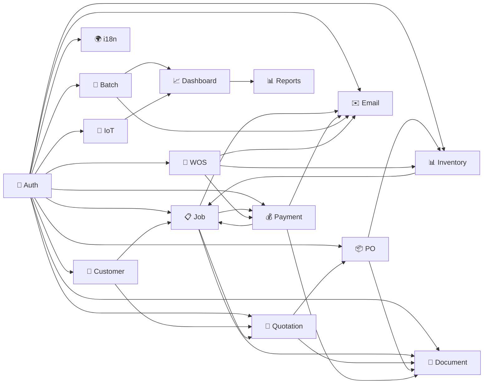

# 🏗️ โครงสร้างระบบ ICMON – แยกตามโมดูลทั้ง 14 โมดูล

แผนภาพด้านล่างแสดงสถาปัตยกรรมของระบบ ICMON แบบ **Clean Architecture + DDD + CQRS** โดยแยกชั้น (Layers) และโมดูล (Modules) อย่างชัดเจน พร้อมความสัมพันธ์ระหว่างกัน

---

## 📊 แผนภาพสถาปัตยกรรม (Mermaid)

```mermaid
flowchart TB
    subgraph Presentation["🎯 Presentation Layer (API)"]
        direction LR
        AuthCtrl["Auth Controller"]
        JobCtrl["Job Controller"]
        CustCtrl["Customer Controller"]
        QuotCtrl["Quotation Controller"]
        POCtrl["PO Controller"]
        InvCtrl["Inventory Controller"]
        PayCtrl["Payment Controller"]
        DashCtrl["Dashboard Controller"]
        RepCtrl["Reports Controller"]
        DocCtrl["Document Controller"]
        EmailCtrl["Email Controller"]
        BatchCtrl["Batch Jobs Controller"]
        LangCtrl["Language Controller"]
        IoTCtrl["IoT Controller"]
        WOSCtrl["WOS Controller"]
    end

    subgraph Application["⚙️ Application Layer (CQRS + MediatR)"]
        direction TB
        subgraph AuthApp["🔐 Authentication"]
            AuthCmd["Commands<br/>(Login, Register, Refresh, Logout)"]
            AuthQry["Queries<br/>(GetCurrentUser)"]
        end
        subgraph JobApp["📋 Job Card"]
            JobCmd["Commands<br/>(Create, UpdateStatus, AddService, AddPart)"]
            JobQry["Queries<br/>(GetById, GetList, StatusSummary)"]
        end
        subgraph CustApp["👤 Customer"]
            CustCmd["Commands<br/>(Create, Update, Delete, AddCar, UpdateCar)"]
            CustQry["Queries<br/>(GetById, GetByPhone, Search, GetCarHistory)"]
        end
        subgraph QuotApp["📄 Quotation"]
            QuotCmd["Commands<br/>(Create, Approve, Reject, Update)"]
            QuotQry["Queries<br/>(GetById, GetByJob, GetList, StatusSummary)"]
        end
        subgraph POApp["📦 Purchase Order"]
            POCmd["Commands<br/>(Create, CreateFromQuotation, Send, Receive)"]
            POQry["Queries<br/>(GetById, GetByQuotation, GetList, TotalByPeriod)"]
        end
        subgraph InvApp["📊 Inventory"]
            InvCmd["Commands<br/>(CreatePart, Receive, Issue, Adjust, CreatePicking, ConfirmPicking)"]
            InvQry["Queries<br/>(GetPart, LowStock, Transactions, PickingList)"]
        end
        subgraph PayApp["💰 Payment"]
            PayCmd["Commands<br/>(RecordPayment, Refund, Confirm)"]
            PayQry["Queries<br/>(GetById, GetByInvoice, Outstanding, Summary)"]
        end
        subgraph DashApp["📈 Dashboard & Reports"]
            DashQry["Queries<br/>(Overview, Sales, JobStatus, Inventory, TopParts, Revenue, Financial)"]
            RepQry["Queries<br/>(Daily, Monthly, Yearly)"]
        end
        subgraph DocApp["📁 Document"]
            DocCmd["Commands<br/>(Generate, Upload, OCR, CreateTemplate)"]
            DocQry["Queries<br/>(GetById, GetByReference, GetList, GetTemplate)"]
        end
        subgraph EmailApp["✉️ Email"]
            EmailCmd["Commands<br/>(Send, SendTemplate, Bulk, Resend)"]
            EmailQry["Queries<br/>(Status, History, Analytics)"]
        end
        subgraph BatchApp["🔄 Batch Jobs"]
            BatchCmd["Commands<br/>(Trigger, Enable, Disable)"]
            BatchQry["Queries<br/>(GetList, Status, History)"]
        end
        subgraph LangApp["🌍 Multi-Language"]
            LangCmd["Commands<br/>(AddLanguage, UpdateLanguage, UpdateTranslation, BulkUpdate)"]
            LangQry["Queries<br/>(GetLanguages, GetCurrent, GetTranslations, GetTranslationByKey)"]
        end
        subgraph IoTApp["📡 IoT & GPS"]
            IoTCmd["Commands<br/>(RegisterDevice, UpdateStatus, CreateGeofence, PublishMQTT)"]
            IoTQry["Queries<br/>(GetDevice, GetLocation, GetHistory, GetAlerts, Summary)"]
        end
        subgraph WOSApp["🛒 Web Order System"]
            WOSCmd["Commands<br/>(AddToCart, UpdateCart, RemoveFromCart, ClearCart, ApplyPromotion, CreateOrder, UpdateOrderStatus, CancelOrder)"]
            WOSQry["Queries<br/>(GetCatalogue, GetCart, GetOrder, GetOrderList)"]
        end
    end

    subgraph Domain["🧠 Domain Layer (Entities, Aggregates, Events)"]
        direction LR
        AuthDom["User, Role, Permission, Token"]
        JobDom["Job, JobService, JobPart, StatusHistory"]
        CustDom["Customer, Car, CarHistory"]
        QuotDom["Quotation, QuotationPart, QuotationService"]
        PODom["PurchaseOrder, PurchaseOrderDetail"]
        InvDom["PartMaster, StockLocation, InventoryTransaction, PickingRequest, Stocktake"]
        PayDom["Payment, Receipt, OutstandingBalance"]
        DashDom["Views (v_dashboard_*)"]
        DocDom["Document, DocumentTemplate, OCRResult"]
        EmailDom["Email, EmailTemplate, EmailQueue"]
        BatchDom["BatchJob, BatchJobHistory"]
        LangDom["Language, Translation"]
        IoTDom["IoTDevice, GPSData, Geofence, GeofenceAlert"]
        WOSDom["CatalogueItem, ShoppingCart, WebOrder"]
    end

    subgraph Infrastructure["🛠️ Infrastructure Layer"]
        direction LR
        EF["Entity Framework Core<br/>(PostgreSQL)"]
        Redis["Redis Cache"]
        Kafka["Kafka Event Bus"]
        MQTT["MQTT Broker"]
        Influx["InfluxDB"]
        Jasper["JasperReports"]
        SMTP["SMTP / SendGrid"]
        Hangfire["Hangfire / Quartz"]
        Storage["File Storage (Local/S3/Azure)"]
        OCR["Tesseract OCR"]
    end

    subgraph External["🌐 External Systems"]
        extMQTT["IoT Devices"]
        extKafka["Other Services"]
        extEmail["Email Providers"]
        extPayment["Payment Gateway"]
    end

    %% Presentation -> Application
    AuthCtrl --> AuthApp
    JobCtrl --> JobApp
    CustCtrl --> CustApp
    QuotCtrl --> QuotApp
    POCtrl --> POApp
    InvCtrl --> InvApp
    PayCtrl --> PayApp
    DashCtrl --> DashApp
    RepCtrl --> RepApp
    DocCtrl --> DocApp
    EmailCtrl --> EmailApp
    BatchCtrl --> BatchApp
    LangCtrl --> LangApp
    IoTCtrl --> IoTApp
    WOSCtrl --> WOSApp

    %% Application -> Domain
    AuthApp --> AuthDom
    JobApp --> JobDom
    CustApp --> CustDom
    QuotApp --> QuotDom
    POApp --> PODom
    InvApp --> InvDom
    PayApp --> PayDom
    DashApp --> DashDom
    RepApp --> DashDom
    DocApp --> DocDom
    EmailApp --> EmailDom
    BatchApp --> BatchDom
    LangApp --> LangDom
    IoTApp --> IoTDom
    WOSApp --> WOSDom

    %% Infrastructure implements Domain interfaces
    AuthDom -.-> AuthInfra
    JobDom -.-> JobInfra
    CustDom -.-> CustInfra
    QuotDom -.-> QuotInfra
    PODom -.-> POInfra
    InvDom -.-> InvInfra
    PayDom -.-> PayInfra
    DashDom -.-> DashInfra
    DocDom -.-> DocInfra
    EmailDom -.-> EmailInfra
    BatchDom -.-> BatchInfra
    LangDom -.-> LangInfra
    IoTDom -.-> IoTInfra
    WOSDom -.-> WOSInfra

    %% Infrastructure Detail
    subgraph InfraDetails["Infrastructure Implementations"]
        AuthInfra["AuthRepository, JWT, PermissionService, RedisCache"]
        JobInfra["JobRepository, UnitOfWork, EventPublisher"]
        CustInfra["CustomerRepository, CarRepository"]
        QuotInfra["QuotationRepository"]
        POInfra["PurchaseOrderRepository"]
        InvInfra["PartRepository, TransactionRepository, PickingRepository"]
        PayInfra["PaymentRepository, ReceiptRepository"]
        DashInfra["DashboardRepository (Dapper), ReportRepository"]
        DocInfra["DocumentRepository, FileStorageService, JasperDocumentGenerator"]
        EmailInfra["EmailRepository, SmtpEmailSender, TemplateEngine"]
        BatchInfra["BatchJobRepository, BatchJobOrchestrator, HangfireService"]
        LangInfra["LanguageRepository, TranslationRepository, LocalizationService"]
        IoTInfra["IoTDeviceRepository, MqttClientService, GpsDataProcessor, InfluxDbService"]
        WOSInfra["CatalogueRepository, CartRepository, OrderRepository, PromotionRepository"]
    end

    %% Infrastructure connects to external
    InfraDetails --> EF
    InfraDetails --> Redis
    InfraDetails --> Kafka
    InfraDetails --> MQTT
    InfraDetails --> Influx
    InfraDetails --> Jasper
    InfraDetails --> SMTP
    InfraDetails --> Hangfire
    InfraDetails --> Storage
    InfraDetails --> OCR

    %% External connections
    MQTT <--> extMQTT
    Kafka <--> extKafka
    SMTP <--> extEmail
    PayApp --> extPayment

    %%  Dependency Direction (Clean Architecture)
    Presentation --> Application
    Application --> Domain
    Infrastructure -.-> Domain
    Application -.-> Infrastructure

    %% Styling
    classDef layer fill:#f9f,stroke:#333,stroke-width:2px;
    classDef module fill:#e1f5fe,stroke:#01579b,stroke-width:1px;
    classDef domain fill:#fff3e0,stroke:#e65100,stroke-width:1px;
    classDef infra fill:#e8f5e9,stroke:#1b5e20,stroke-width:1px;
    classDef external fill:#fce4ec,stroke:#c62828,stroke-width:1px;
    class Presentation,Application,Domain,Infrastructure layer;
    class AuthApp,JobApp,CustApp,QuotApp,POApp,InvApp,PayApp,DashApp,DocApp,EmailApp,BatchApp,LangApp,IoTApp,WOSApp module;
    class AuthDom,JobDom,CustDom,QuotDom,PODom,InvDom,PayDom,DashDom,DocDom,EmailDom,BatchDom,LangDom,IoTDom,WOSDom domain;
    class AuthInfra,JobInfra,CustInfra,QuotInfra,POInfra,InvInfra,PayInfra,DashInfra,DocInfra,EmailInfra,BatchInfra,LangInfra,IoTInfra,WOSInfra infra;
    class extMQTT,extKafka,extEmail,extPayment external;
```



---

## 🧱 คำอธิบายแต่ละชั้น (Layers)

| Layer | บทบาท | เทคโนโลยีหลัก |
|-------|-------|--------------|
| **Presentation** | รับ Request จาก Client, ตรวจสอบสิทธิ์, ส่งต่อ Command/Query | ASP.NET Core Web API, Swagger, Rate Limiting, JWT |
| **Application** | จัดการ Business Logic ผ่าน CQRS, ตรวจสอบข้อมูล (Validation), แปลง DTO | MediatR, FluentValidation, AutoMapper |
| **Domain** | กำหนด Entities, Value Objects, Aggregates, Events, Interfaces สำหรับ Repository | C# Classes, Domain Events |
| **Infrastructure** | Implement Repository, ติดต่อ Database, Cache, Message Queue, External Services | EF Core, Redis, Kafka, MQTT, InfluxDB, JasperReports |

---

## 📦 รายละเอียดแต่ละโมดูล (Modules)

### 1. Authentication & Permission
- **Presentation**: `AuthController` (Login, Logout, Refresh, Register, Me)
- **Application**: Commands/Queries สำหรับ Authentication
- **Domain**: `User`, `Role`, `Permission`, `UserToken`
- **Infrastructure**: JWT Service, Permission Service, Repository, Redis Cache

### 2. Job Card Management
- **Presentation**: `JobsController`
- **Application**: Create, UpdateStatus, AddService, AddPart, GetById, GetList, StatusSummary
- **Domain**: `Job` (Aggregate Root), `JobService`, `JobPartSales`, `JobStatusHistory`, `JobSymptom`, `JobDiagnosticCode`
- **Infrastructure**: `JobRepository`, Caching, Event Publishing

### 3. Customer Management
- **Presentation**: `CustomersController`, `CarsController`
- **Application**: Create/Update/Delete Customer, Add/Update/Delete Car, Search
- **Domain**: `Customer`, `Car`, `CustomerCarHistory`
- **Infrastructure**: `CustomerRepository`, `CarRepository`

### 4. Quotation
- **Presentation**: `QuotationsController`
- **Application**: Create, Approve, Reject, Update, GetById, GetByJob, GetList, StatusSummary
- **Domain**: `Quotation`, `QuotationPart`, `QuotationService`, `QuotationStatusHistory`
- **Infrastructure**: `QuotationRepository`, PDF Generation (JasperReports)

### 5. Purchase Order
- **Presentation**: `PurchaseOrdersController`
- **Application**: Create (Manual & From Quotation), Send, Receive, GetById, GetList, TotalByPeriod, Suggestion
- **Domain**: `PurchaseOrder`, `PurchaseOrderDetail`, `PurchaseOrderStatusHistory`
- **Infrastructure**: `PurchaseOrderRepository`, PDF Generation

### 6. Inventory Management
- **Presentation**: `InventoryController`, `PartPickingController`
- **Application**: CreatePart, Receive, Issue, Adjust, CreatePicking, ConfirmPicking, LowStock, Transactions
- **Domain**: `PartMaster`, `StockLocation`, `InventoryTransaction`, `PartPickingRequest`, `Stocktake`
- **Infrastructure**: `PartMasterRepository`, `InventoryTransactionRepository`, `PickingRepository`

### 7. Payment Management
- **Presentation**: `PaymentsController`, `ReceiptsController`
- **Application**: RecordPayment, Refund, Confirm, GetOutstanding, GetByInvoice, Summary
- **Domain**: `Payment`, `Receipt`, `PaymentHistory`, `OutstandingBalance`
- **Infrastructure**: `PaymentRepository`, `ReceiptRepository`, PDF Receipt

### 8. Dashboard & Reports
- **Presentation**: `DashboardController`, `ReportsController`
- **Application**: Queries for Overview, Sales, JobStatus, Inventory, TopParts, Revenue, Financial, Daily/Monthly/Yearly Reports
- **Domain**: Database Views (`v_dashboard_*`)
- **Infrastructure**: `DashboardRepository` (Dapper), `ReportRepository`, JasperReports Generator

### 9. Document Management
- **Presentation**: `DocumentsController`
- **Application**: GenerateDocument, UploadDocument, ProcessOCR, CreateTemplate
- **Domain**: `Document`, `DocumentTemplate`, `DocumentHistory`, `OCRResult`
- **Infrastructure**: `DocumentRepository`, File Storage (Local/S3/Azure), JasperReports Integration, Tesseract OCR

### 10. Email Service
- **Presentation**: `EmailController`
- **Application**: SendEmail, SendTemplate, BulkEmail, Resend, GetStatus, GetHistory, GetAnalytics
- **Domain**: `Email`, `EmailTemplate`, `EmailQueue`, `EmailHistory`
- **Infrastructure**: `EmailRepository`, SMTP/SendGrid, Razor Template Engine

### 11. Batch Jobs
- **Presentation**: `BatchJobsController`
- **Application**: Trigger, Enable, Disable, GetList, GetStatus, GetHistory
- **Domain**: `BatchJob`, `BatchJobHistory`
- **Infrastructure**: Hangfire/Quartz, `BatchJobOrchestrator`, 6 predefined jobs

### 12. Multi-Language (i18n)
- **Presentation**: `LanguagesController`
- **Application**: AddLanguage, UpdateLanguage, UpdateTranslation, BulkUpdate, GetLanguages, GetCurrent, GetTranslations
- **Domain**: `Language`, `Translation`
- **Infrastructure**: `LanguageRepository`, `TranslationRepository`, `LocalizationService`, CustomStringLocalizer, Middleware

### 13. IoT & GPS Tracking
- **Presentation**: `IoTController`, `MqttController`
- **Application**: RegisterDevice, UpdateStatus, CreateGeofence, PublishMQTT, GetLocation, GetHistory, GetAlerts, Summary
- **Domain**: `IoTDevice`, `GPSData`, `Geofence`, `GeofenceAlert`, `DeviceHistory`
- **Infrastructure**: `IoTDeviceRepository`, `MqttClientService`, `GpsDataProcessor`, `GeofenceService`, `InfluxDbService`

### 14. Web Order System (WOS)
- **Presentation**: `WOSCatalogueController`, `WOSCartController`, `WOSOrdersController`
- **Application**: AddToCart, UpdateCart, RemoveFromCart, ClearCart, ApplyPromotion, CreateOrder, UpdateOrderStatus, CancelOrder, GetCatalogue, GetCart, GetOrder, GetOrderList
- **Domain**: `CatalogueItem`, `CatalogueCategory`, `SalesPrice`, `Promotion`, `ShoppingCart`, `ShoppingCartItem`, `WebOrder`, `WebOrderItem`, `WebOrderStatusHistory`
- **Infrastructure**: `CatalogueRepository`, `CartRepository`, `OrderRepository`, `PromotionRepository`, `OrderNumberService`

---

## 🔄 ความสัมพันธ์ระหว่างโมดูล



---

## 🗂️ สรุปโครงสร้างโฟลเดอร์ (Solution Explorer)

```
ICMON.sln
├── ICMON.Domain
│   ├── Aggregates
│   │   ├── Auth
│   │   ├── JobAggregate
│   │   ├── CustomerAggregate
│   │   ├── QuotationAggregate
│   │   ├── PurchaseOrderAggregate
│   │   ├── InventoryAggregate
│   │   ├── PaymentAggregate
│   │   ├── DocumentAggregate
│   │   ├── EmailAggregate
│   │   ├── BatchJobAggregate
│   │   ├── LanguageAggregate
│   │   ├── IoTAggregate
│   │   └── WOSAggregate
│   ├── Enums
│   ├── Events
│   ├── ValueObjects
│   ├── Interfaces (IRepository, IUnitOfWork, IEventPublisher)
│   ├── Exceptions
│   └── Specifications
├── ICMON.Application
│   ├── Commands
│   │   ├── Auth
│   │   ├── Jobs
│   │   ├── Customers
│   │   ├── Quotations
│   │   ├── PurchaseOrders
│   │   ├── Inventory
│   │   ├── Payments
│   │   ├── Documents
│   │   ├── Emails
│   │   ├── BatchJobs
│   │   ├── Languages
│   │   ├── IoT
│   │   └── WOS
│   ├── Queries
│   │   ├── Auth
│   │   ├── Jobs
│   │   ├── Customers
│   │   ├── Quotations
│   │   ├── PurchaseOrders
│   │   ├── Inventory
│   │   ├── Payments
│   │   ├── Dashboards
│   │   ├── Reports
│   │   ├── Documents
│   │   ├── Emails
│   │   ├── BatchJobs
│   │   ├── Languages
│   │   ├── IoT
│   │   └── WOS
│   ├── DTOs
│   ├── Mappings (AutoMapper)
│   ├── Validators (FluentValidation)
│   ├── Behaviors (Pipeline)
│   ├── Services (Interfaces)
│   └── Common (BaseCommand, Result)
├── ICMON.Infrastructure
│   ├── Persistence
│   │   ├── Configurations (EF)
│   │   ├── Repositories
│   │   ├── Migrations
│   │   └── SeedData
│   ├── Cache (Redis)
│   ├── Messaging (Kafka)
│   ├── IoT (MQTT, InfluxDB)
│   ├── BackgroundJobs (Hangfire/Quartz)
│   ├── DocumentGeneration (JasperReports, OCR)
│   ├── Email (SMTP, SendGrid, TemplateEngine)
│   ├── Authentication (JWT, Permission)
│   ├── Localization
│   ├── Storage (File)
│   └── Extensions (DI)
├── ICMON.Api
│   ├── Controllers
│   ├── Middleware
│   ├── Filters
│   ├── Attributes
│   ├── Program.cs
│   └── appsettings.json
├── ICMON.Shared
│   ├── Constants
│   ├── Helpers
│   ├── Extensions
│   └── Resources (i18n JSON)
├── tests
│   ├── ICMON.UnitTests
│   ├── ICMON.IntegrationTests
│   └── ICMON.ArchitectureTests
├── Templates (JasperReports)
│   ├── Reports
│   └── Compiled
├── docker-compose.yml
├── Dockerfile
└── README.md
```

---

## 📌 สรุป

ระบบ ICMON ถูกออกแบบด้วย Clean Architecture + DDD + CQRS แบ่งเป็น 4 ชั้นหลักและ 14 โมดูลการทำงาน ซึ่งครอบคลุมทุกฟังก์ชันของอู่ซ่อมรถ ตั้งแต่การรับรถเข้าซ่อม การเสนอราคา การสั่งซื้ออะไหล่ การจัดการสต็อก การชำระเงิน ไปจนถึงระบบ IoT และระบบสั่งซื้อออนไลน์ โดยแต่ละโมดูลแยกจากกันอย่างชัดเจน ทำให้ง่ายต่อการพัฒนา ทดสอบ และบำรุงรักษา 🚀